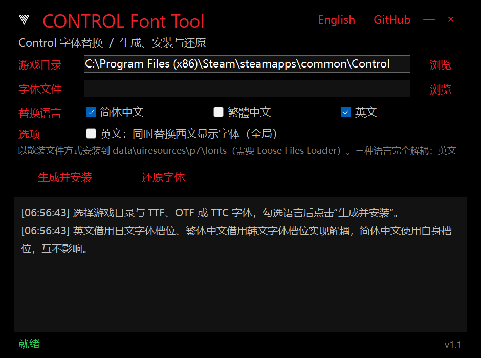

# CONTROL Font Tool

[中文](#中文) | [English](#english)

<p align="center">
  
</p>

## Download / 下载

[](https://github.com/jakeouyang/ControlFontTool/releases/latest)

- 中文：前往 [Releases](https://github.com/jakeouyang/ControlFontTool/releases/latest) 下载最新 `ControlFontTool-v*-win-x64.zip`，解压即用，无需安装 .NET。
- English: grab the latest `ControlFontTool-v*-win-x64.zip` from [Releases](https://github.com/jakeouyang/ControlFontTool/releases/latest) — portable and self-contained, no .NET installation required.

> 英文/繁體功能需要按下方说明准备一次 .ui 资源 / English & Traditional Chinese need the one-time UI resource setup below.

---

## 中文

Windows x64《Control》（控制）界面字体替换工具。支持**简体中文、繁體中文、英文**三种界面语言的字体替换，三种语言完全解耦、互不影响。字体以散装文件（loose files）方式安装，不改动任何游戏原版档案，可一键还原。

### 功能

- **三语言解耦**：
  - 简体中文 → 游戏原生 `NotoSansSC-*` 槽位
  - 繁體中文 → 劫持韩文字体槽（`NatoSansKR→NatoSansZH`、`:lang(ko)→:lang(zhtw)`），写入 `NotoSansZH-*`
  - 英文 → 劫持日文字体槽（`NatoSansJP→NatoSansEN`、`:lang(ja)→:lang(en)`），写入 `NotoSansEN-*`
  - 原版 `NotoSansTC/SC` 等档案内文件永远不被改动；日文/韩文界面回退为默认字体
- **英文附加选项**：同时替换西文显示字体（Akzidenz-Grotesk、Aktiv-Grotesk、Interstate、AvantGarde，全语言共用的 HUD/标题字体）
- **字符覆盖报告**：按 ASCII / Latin-1 / 符号 / CJK 标点 / GB2312 / Big5 字符集统计缺字数量与示例；所选字体不含汉字时拒绝生成中文字库
- **安装清单与还原**：记录全部哈希，跨多次重装仍可一键恢复到最初状态；与已有散装 .ui 的 mod（如图标替换）自动组合，互不覆盖
- **安全检查**：游戏运行时拒绝操作、游戏目录校验、Loose Files Loader 检测

### 使用

1. 从 [Releases](https://github.com/jakeouyang/ControlFontTool/releases/latest) 下载并解压（或自行构建）
2. 安装 [Loose Files Loader](https://www.nexusmods.com/control/mods/84)（`iphlpapi.dll` 放入游戏根目录）
3. 运行 `ControlFontTool.exe`，选择游戏根目录与字体文件（TTF / OTF / TTC）
4. 勾选语言，点击 **生成并安装**；**还原字体** 可随时恢复原版

字体以散装文件写入 `data\uiresources\p7\fonts\`，.ui 重定向补丁写入 `data\uiresources\p7\`。

### 从源码构建

```powershell
dotnet build ControlFontTool.csproj -c Release
dotnet publish ControlFontTool.csproj -c Release -r win-x64 --self-contained true `
  -p:PublishSingleFile=true -p:IncludeNativeLibrariesForSelfExtract=true -o publish
```

要求 .NET 9 SDK（Windows，启用桌面工作负载）。

### 准备 UI 资源（重要）

游戏 `.ui` 资源为受版权保护的游戏文件，**本仓库不分发**。英文 / 繁體中文的字体槽重定向需要 8 个原始 `.ui` 文件，请从**你自己的游戏**中提取一次：

```powershell
# 使用 NorthlightTools（https://github.com/GrzybDev/NorthlightTools）
NorthlightTools rmdp extract "<游戏目录>\data_packfiles\ep100-000-generic.rmdp" <临时目录>
copy <临时目录>\data\uiresources\p7\*.ui ControlFontTool\Resources\Ui\
```

放入后重新构建（或放到 exe 旁的 `Resources\Ui\` 目录）。**简体中文替换不需要此步骤**。未提供资源时选择英文/繁体会得到明确报错。

### CLI

```powershell
ControlFontTool.exe install <游戏目录> <字体> [--sc] [--tc] [--en] [--western] [--zh]
ControlFontTool.exe restore <游戏目录> [--zh]
ControlFontTool.exe validate-game <游戏目录>
```

### 致谢

- 工具形态与 UI 参考 [W3FontTool](https://github.com/)（巫师 3 字体工具）
- [GrzybDev/NorthlightTools](https://github.com/GrzybDev/NorthlightTools)（rmdp 解包）
- [eprilx/NorthlightFontMaker](https://github.com/eprilx/NorthlightFontMaker)（binfnt 格式研究）

### 免责声明

本项目与 Remedy Entertainment 及 505 Games 无关。不分发任何游戏资源；请支持正版。

## English

Windows x64 UI font replacement tool for *Control*. Supports **Simplified Chinese, Traditional Chinese, and English** with fully decoupled per-language font slots. Fonts install as loose files — no game archives are modified, and everything is reversible.

### Features

- **Decoupled languages**:
  - Simplified Chinese → the game's own `NotoSansSC-*` slots
  - Traditional Chinese → repurposed Korean slot (`NatoSansKR→NatoSansZH`, `:lang(ko)→:lang(zhtw)`), written as `NotoSansZH-*`
  - English → repurposed Japanese slot (`NatoSansJP→NatoSansEN`, `:lang(ja)→:lang(en)`), written as `NotoSansEN-*`
  - Original `NotoSansTC/SC` archives are never touched; Japanese/Korean UI falls back to the default font
- **English add-on**: optionally also replace the western display fonts (Akzidenz-Grotesk, Aktiv-Grotesk, Interstate, AvantGarde — shared by all languages)
- **Coverage report**: missing-glyph counts and samples against ASCII / Latin-1 / symbols / CJK punctuation / GB2312 / Big5; refuses to build a Chinese library from a font without CJK glyphs
- **Manifest & restore**: every change is hash-tracked; restore returns to the pre-install state even after multiple reinstalls; composes with existing loose-.ui mods (e.g. icon packs)
- **Safety checks**: refuses to run while the game is running; game folder validation; Loose Files Loader detection

### Usage

1. Download and extract the latest build from [Releases](https://github.com/jakeouyang/ControlFontTool/releases/latest) (or build it yourself)
2. Install the [Loose Files Loader](https://www.nexusmods.com/control/mods/84) (`iphlpapi.dll` into the game root)
3. Run `ControlFontTool.exe`, pick the game folder and a font file (TTF / OTF / TTC)
4. Check languages, click **Build and install**; **Restore font** reverts anytime

Fonts are written to `data\uiresources\p7\fonts\`, the .ui repoint patches to `data\uiresources\p7\`.

### Building from source

```powershell
dotnet build ControlFontTool.csproj -c Release
dotnet publish ControlFontTool.csproj -c Release -r win-x64 --self-contained true `
  -p:PublishSingleFile=true -p:IncludeNativeLibrariesForSelfExtract=true -o publish
```

Requires the .NET 9 SDK (Windows, desktop workload).

### Preparing the UI resources (important)

The game's `.ui` resources are copyrighted game files and are **not distributed with this repository**. The English / Traditional Chinese slot repointing needs 8 pristine `.ui` files — extract them once from **your own game**:

```powershell
# Using NorthlightTools (https://github.com/GrzybDev/NorthlightTools)
NorthlightTools rmdp extract "<game>\data_packfiles\ep100-000-generic.rmdp" <tmp>
copy <tmp>\data\uiresources\p7\*.ui ControlFontTool\Resources\Ui\
```

Rebuild afterwards (or place them in a `Resources\Ui\` folder next to the exe). **Simplified Chinese replacement does not need this step.** Selecting English/Traditional without the resources produces a clear error.

### CLI

```powershell
ControlFontTool.exe install <game> <font> [--sc] [--tc] [--en] [--western] [--zh]
ControlFontTool.exe restore <game> [--zh]
ControlFontTool.exe validate-game <game>
```

### Credits

- Tool concept & UI inspired by W3FontTool (Witcher 3 font tool)
- [GrzybDev/NorthlightTools](https://github.com/GrzybDev/NorthlightTools) (rmdp extraction)
- [eprilx/NorthlightFontMaker](https://github.com/eprilx/NorthlightFontMaker) (binfnt format research)

### Disclaimer

This project is not affiliated with Remedy Entertainment or 505 Games. No game assets are distributed; please support the official release.
